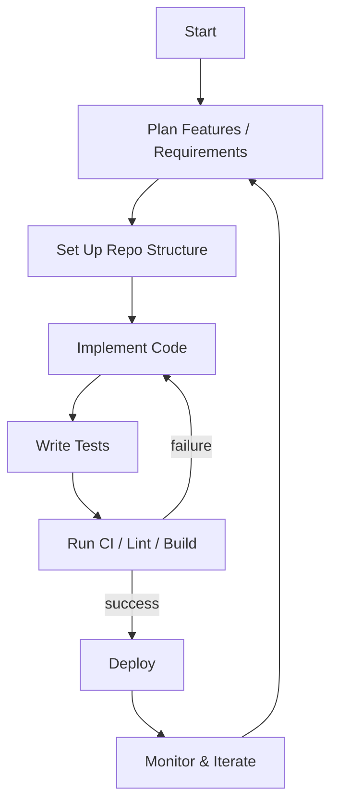

# Project Flowchart

Below is a high-level flowchart for this project. As the repository currently contains placeholder files (`first.txt`, `second.txt`, `New/third.txt`) and no application code or build configuration, the diagram represents a generic project lifecycle you can adapt once code is added.

## How to adapt
- Replace generic nodes with your real components (e.g., API, UI, DB, jobs).
- Add branches for key flows (auth, data ingestion, background tasks, etc.).
- If you add framework-specific files (e.g., `package.json`, `pyproject.toml`), update this chart to reflect build and deploy steps.
